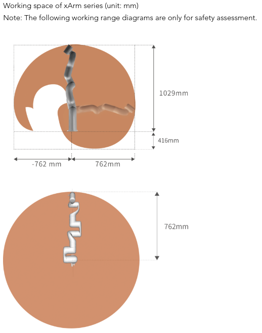

# UFactory XARM7


# 1. Information

## 1. Working Range



## 2. Dimension

### TCP


### BASE


## 3. H/W Specification


## 4. S/W Support

1. Official Site
    
    [xArm Robot | UFACTORY](https://www.ufactory.cc/xarm-collaborative-robot/)
    
2. Downloads
    
    [Download Center | UFACTORY](https://www.ufactory.cc/download/)
    
3. UFactory Studio
    
    [UFACTORY Studio | UFACTORY](https://www.ufactory.cc/ufactory-studio/)
    
4. ROS2
    
    [GitHub - xArm-Developer/xarm_ros2: ROS2 developer packages for robotic products from UFACTORY](https://github.com/xArm-Developer/xarm_ros2?utm_source=officialwebsite&utm_medium=banner&utm_campaign=none)
    

# 2. Setting

### Ubuntu

1. 네트워크 설정에서, 제어기에 부착된 제어기 네트워크를 DNS로 설정.
    1. Address : `192.168.1.xxx` 
        
        → 사용하지 않는 임의 주소로 설정 (e.g., `192.168.1.10`)
        
    2. Netmask : `255.255.255.0`
    3. Gateway : 공백 설정
    4. DNS : Automatic 
        
        → ~~제어기에 부착된 IP (e.g., `192.168.1.245`)~~
        
        
        
2. 설정 후, UFactory Studio를 사용하거나, Web을 통해 `Connect` 가능
    1. UFactory Studio
        
        [UFACTORY Studio | UFACTORY](https://www.ufactory.cc/ufactory-studio/)
        
    2. Web
        1. 제어기에 부착된 IP:포트(18333)
            
            e.g.,) 192.168.1.245:18333
            
3. 활성화 `Enable` 선택 → 로봇 브레이크 풀리며 사용 가능함
4. 로봇 IP 주소 변경 → USB to Lan으로 연결시, 호스트 IP 대역과 충돌 방지를 위해 설정
    1. Setting → Device Info
        1. Ip Address만 수정(나머지 안건드림)
            1. ex) `192.168.5.xxx` (xxx는 로봇에 설정된 IP 그대로 유지)
                
                
                

# 3. Port Forwarding Setting

### Ubuntu  Usb to Lan으로 연결된 장치를 외부에서 접속가능하도록 포트포워딩

1. 패키지 설치.(방화벽 활성화시 안될수 있어 방화벽 확인 필요)
    
    ```bash
    sudo apt update
    sudo apt install socat  # Ubuntu/Debian 계열
    # sudo yum install socat  # CentOS/RHEL 계열
    ```
    
2. 포트포워딩 실행(종료시 포트포워딩 중지). 로봇의 IP에 맞게 명령어 변경
    
    ```bash
    sudo socat TCP4-LISTEN:18333,fork,reuseaddr TCP4:192.168.x.xxx:18333
    ```
    
    이후 Ufactory Studio 혹은 브라우저에서 로봇이 연결된 PC IP:18333을 통해 접속되는지 확인.(로봇 IP가 아님)
    
3. PC 부팅시 자동 포워딩 설정.(Systemd 이용)
    
    서비스 파일 생성
    
    ```bash
    sudo nano /etc/systemd/system/xarm-bridge.service
    ```
    
    내용 작성
    
    ```toml
    [Unit]
    Description=uFactory xArm Web Bridge (socat)
    After=network.target
    
    [Service]
    Type=simple
    # 명령어가 실패해도 계속 재시작하도록 설정
    Restart=always
    RestartSec=5
    # socat 실행 명령어. IP 주소는 로봇에 맞게 변경
    ExecStart=/usr/bin/socat TCP4-LISTEN:18333,fork,reuseaddr TCP4:192.168.5.240:18333
    
    [Install]
    WantedBy=multi-user.target
    ```
    
    시스템 서비스 활성화
    
    ```bash
    # 1. 새로운 서비스 파일 인식
    sudo systemctl daemon-reload
    
    # 2. 부팅 시 자동 실행 설정
    sudo systemctl enable xarm-bridge
    
    # 3. 지금 즉시 서비스 시작
    sudo systemctl start xarm-bridge
    ```
    

# 4. Initial Robot Setting

### Robot Initial Position 세팅

- Setting → Motion → Parameters
- Initial Position 각 조절(실제 로봇 충돌하는지 확인하면서 수정)
    
    
    

### TCP Payload 설정(로봇 토크 부족 에러 발생시)

- Setting → Motion → TCP
    - + New 혹은 기존에 생성된 프로파일에서 Payload의 Weight 값 조절. (ex. 2.5kg)
        
        